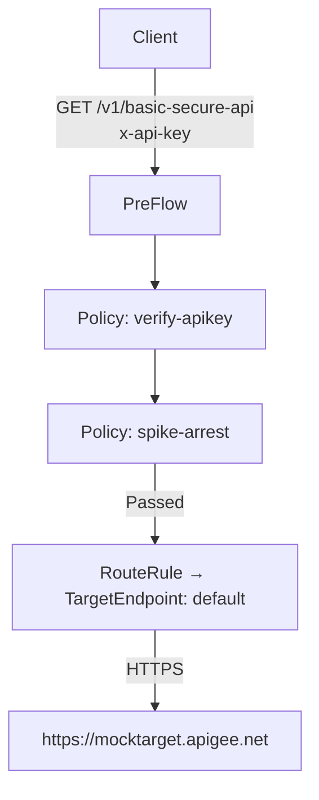

# GetBasicSecureProxy Documentation

## 1. Requirement Summary

**Purpose:**  
A basic API proxy enforcing API key authentication (via `x-api-key` header) and spike arrest at a rate of 5 requests per second.

**Key Features:**  
- Secures backend with API key verification.
- Throttles incoming requests to 5 per second to prevent abuse.

---

## 2. Proxy Details

- **Proxy Name:** GetBasicSecureProxy
- **Version:** 1.0
- **Base Path:** `/v1/basic-secure-api`
- **Description:** Enforces API key authentication and implements rate-limiting.
- **Allowed HTTP Methods:** `GET`

---

## 3. Routing Rules

- **Route Rule Name:** default
- **Condition:** (None specified; all requests routed)
- **Target Endpoint:** `default`

---

## 4. Target Endpoints

- **Name:** default
- **Type:** HTTP Target
- **URL:** `https://mocktarget.apigee.net`

---

## 5. Policies

### a. API Key Verification

- **Policy Name:** verify-apikey
- **Type:** VerifyAPIKey
- **Configuration:**
  - **API Key Source:** HTTP Header
  - **Header Name:** `x-api-key`

### b. Spike Arrest

- **Policy Name:** spike-arrest
- **Type:** SpikeArrest
- **Configuration:**
  - **Rate:** 5 requests per second (`5ps`)

---

## 6. Generated Files

| Path                                      | Type           | Description                     |
|-------------------------------------------|----------------|---------------------------------|
| apiproxy/GetBasicSecureProxy.xml          | api_proxy      | Proxy configuration             |
| apiproxy/proxies/default.xml              | proxy_endpoint | Inbound rules, flows, routing   |
| apiproxy/targets/default.xml              | target_endpoint| Outbound target configuration   |
| apiproxy/policies/verify-apikey.xml       | policy         | API key verification policy     |
| apiproxy/policies/spike-arrest.xml        | policy         | Spike arrest policy             |

---

## 7. Security Design

- **Authentication:**  
  Requests must include a valid API key (passed via `x-api-key` HTTP header).  
  The proxy validates this key against Apigee credentials.

- **Rate Limiting:**  
  Spike arrest ensures that a single client cannot send more than 5 requests per second.

- **Transport Security:**  
  All backend communication occurs over HTTPS.

---

## 8. Request Flow



**Sequence:**

1. Client sends a GET request to `/v1/basic-secure-api` with a valid `x-api-key` header.
2. The proxy executes the PreFlow:
   1. Runs `verify-apikey` policy (rejects if absent/invalid).
   2. Applies `spike-arrest` (blocks if over rate).
3. Upon passing both policies:
   - Forwards request to the target backend via HTTPS.
4. Backend response is returned unaltered.

---

## 9. Assumptions

- All incoming requests require authentication via a valid API key.
- Only `GET` requests are supported; others may be rejected/not handled.
- The backend endpoint (`https://mocktarget.apigee.net`) is operational.
- No custom error messaging or fault handling is defined (default Apigee behavior applies).

---

## 10. Clarifications Required

- None outstanding as per current configuration and validation.

---

## 11. Deployment Structure

```
apiproxy/
├── GetBasicSecureProxy.xml
├── proxies/
│   └── default.xml
├── targets/
│   └── default.xml
└── policies/
    ├── spike-arrest.xml
    └── verify-apikey.xml
```

- **Proxy Endpoint:** Defined in `proxies/default.xml` – manages inbound routing, PreFlow, PostFlow.
- **Target Endpoint:** Defined in `targets/default.xml` – outbound connection details.
- **Policies:** Defined per feature, attached in PreFlow of the ProxyEndpoint.

---

## 12. Testing Recommendations

### a. Positive Test

- **Request:**
  - `GET /v1/basic-secure-api`
  - Headers: `x-api-key: <valid_api_key>`, `Content-Type: application/json`
- **Expected Response:** HTTP 200 (with response from mocktarget)

### b. Missing API Key

- **Request:** No `x-api-key` header.
- **Expected Response:** HTTP 401 Unauthorized (API key missing/invalid).

### c. Invalid API Key

- **Request:** `x-api-key: <invalid_key>`
- **Expected Response:** HTTP 401 Unauthorized.

### d. Spike Arrest

- **Request:** More than 5 requests per second from same client/API key.
- **Expected Response:** HTTP 429 Too Many Requests for 6th and subsequent requests in a second.

### e. Unsupported HTTP Methods

- **Request:** POST, PUT, DELETE, etc.
- **Expected Response:** HTTP 405 Method Not Allowed (if enforced by proxy/default Apigee behavior).

---

**Note:** Use the included test request as a baseline, and consider automating tests for all above cases.  
**Sample Curl:**

```sh
curl -X GET "https://{org}-{env}.apigee.net/v1/basic-secure-api" \
  -H "x-api-key: <API_KEY>" \
  -H "Content-Type: application/json"
```
Replace `{org}-{env}` and `<API_KEY>` appropriately.
