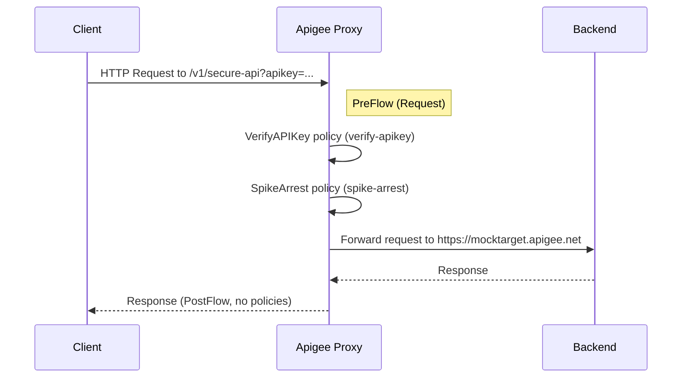

# SecureProxy (v1.0) — Documentation

## 1. Requirement Summary

This API proxy, **SecureProxy**, is designed to front an internal or external HTTP(s) backend endpoint. It enforces:
- API Key verification (API Key expected as a query parameter named `apikey`)
- Traffic smoothing using Spike Arrest (limit: 5 requests per second)

## 2. Proxy Details

| Property      | Value                             |
|---------------|-----------------------------------|
| **Name**      | SecureProxy                       |
| **Version**   | 1.0                               |
| **Base Path** | `/v1/secure-api`                  |
| **Description** | Enforces API key security and smooths incoming traffic with spike arrest.  |

## 3. Routing Rules

| Name     | Condition      | Target Endpoint |
|----------|---------------|----------------|
| default  | *(Always)*     | default        |

*All matching requests are routed to the target endpoint named `default`.*

## 4. Target Endpoints

| Name     | Description                                         | URL                               |
|----------|-----------------------------------------------------|-----------------------------------|
| default  | Backend endpoint for all traffic                    | `https://mocktarget.apigee.net`   |

## 5. Policies

### 5.1. Verify API Key

- **Policy Name:** `verify-apikey`
- **Policy Type:** [`VerifyAPIKey`](https://docs.apigee.com/api-platform/reference/policies/verify-apikey-policy)
- **Applied In:** ProxyEndpoint → PreFlow → Request
- **Configuration:**
  - Requires `apikey` to be present in the query string (`request.queryparam.apikey`)
- **Behavior:** 
  - Fails requests with missing/invalid API Key with `401 Unauthorized`

### 5.2. Spike Arrest

- **Policy Name:** `spike-arrest`
- **Policy Type:** [`SpikeArrest`](https://docs.apigee.com/api-platform/reference/policies/spike-arrest-policy)
- **Applied In:** ProxyEndpoint → PreFlow → Request
- **Configuration:**
  - Rate: `5ps` (5 requests per second per Apigee message processor instance)
- **Behavior:** 
  - Limits traffic bursts and helps protect backend from sudden spikes

## 6. Generated Files

| Path                                         | Purpose                      |
|----------------------------------------------|------------------------------|
| `apiproxy/SecureProxy.xml`                   | API Proxy configuration      |
| `apiproxy/proxies/default.xml`               | Proxy endpoint definition    |
| `apiproxy/targets/default.xml`               | Target endpoint definition   |
| `apiproxy/policies/verify-apikey.xml`        | VerifyAPIKey policy          |
| `apiproxy/policies/spike-arrest.xml`         | SpikeArrest policy           |

## 7. Security Design

- **API Key Required:** Yes — must be supplied as query param: `apikey`
- **Authorization Enforcement:** Handled by `VerifyAPIKey` policy
- **Traffic Protection:** Spike Arrest policy prevents abuse or accidental overload (5RPS per message processor)
- **No explicit transport security (TLS) handled by proxy itself** — assumes TLS at endpoint
  
## 8. Request Flow



#### **Detailed Steps**
1. Client sends request with `apikey` as query param to `/v1/secure-api`.
2. **PreFlow (Request):**
    - `verify-apikey` policy checks for valid Apigee-registered API key
    - If valid, `spike-arrest` enforces 5RPS per message processor
3. If both checks pass, request is routed to backend: `https://mocktarget.apigee.net`.
4. Backend response flows back with no modification (no response policies).

## 9. Assumptions

- The consumers **always provide the API key** as a `queryparam` (`apikey`).
- No request/response payload transformations are required.
- No custom error handling is defined in the proxy.
- Only one route (`default`) is needed; no conditional or multiple routing rules exist.
- The backend endpoint (`https://mocktarget.apigee.net`) is reachable and reliable.

## 10. Clarifications Required

_No clarifications currently tracked for this design._

## 11. Deployment Structure

- **Single Proxy**: `SecureProxy` (v1.0)
- **Proxy Endpoint**: `default`
- **Target Endpoint**: `default`
- **Policies**: 
    - `verify-apikey` and `spike-arrest` both attached to ProxyEndpoint PreFlow (Request)
- **File Structure:**

    ```
    apiproxy/
    ├─ SecureProxy.xml
    ├─ policies/
    │   ├─ verify-apikey.xml
    │   └─ spike-arrest.xml
    ├─ proxies/
    │   └─ default.xml
    └─ targets/
        └─ default.xml
    ```

- **Deployment Command Example:**
    ```sh
    apigeecli apis import --file ./apiproxy --name SecureProxy --env [ENVIRONMENT]
    ```

## 12. Testing Recommendations

### Positive Tests

- Send request to `/v1/secure-api?apikey={VALID_KEY}` should proxy traffic to backend.
- Send up to 5 requests per second per API key without error.

### Negative Tests

- Omit `apikey` query parameter; expect `401 Unauthorized`.
- Send incorrect/invalid API key; expect `401 Unauthorized`.
- Exceed rate limit (e.g., >5RPS per message processor); expect `429 Too Many Requests`.

### Other Recommendations

- Test backend outage scenario to verify proxy behavior and error propagation.
- Confirm audit log entries for rejected requests.
- Test on both HTTP (`http`) and HTTPS (`https`) to verify protocol restrictions if applicable downstream.
- Automate spike arrest stress testing to ensure limits are enforced as expected.

---

**End of Documentation for SecureProxy API Proxy.**